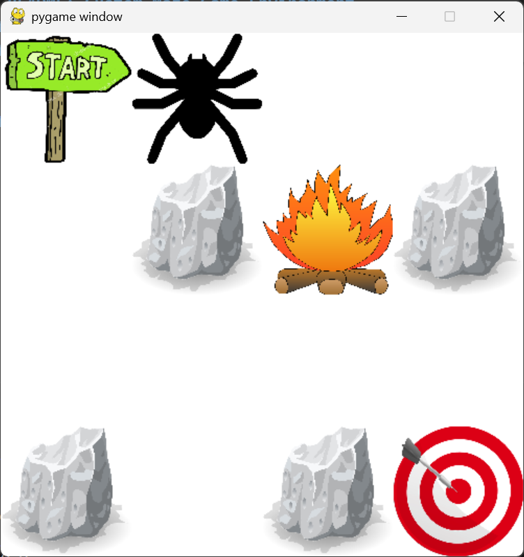

# **Custom Maze Game Environment for Reinforcement Learning**

## **Overview**

This project demonstrates the creation and utilization of a custom Gymnasium environment for Reinforcement Learning (RL). The environment simulates a maze with customizable elements such as obstacles, death-pits, a start position, and a goal. The agent learns to navigate the maze using **Stable-Baselines3 (SB3)** reinforcement learning algorithms.

The environment is fully compatible with SB3, allowing seamless integration for training and testing RL models.

---

## **Demo**



**Watch the Demo Video**:
[Demo Video Link](https://drive.google.com/file/d/11j2hhNSLZNuGT9sk-3PGglSV1LwqpxXw/view?usp=sharing)

---

## **Features**

1. **Customizable Maze Layout**:

   * Define maze elements using:

     * `S`: Starting position
     * `G`: Goal position
     * `#`: Obstacles
     * `P`: Death-pits (penalize and terminate the episode)
     * `.`: Empty cells

2. **Dynamic Agent Behavior**:

   * The agent receives rewards for reaching the goal and penalties for inefficiency or stepping into a death-pit.

3. **Rendering with Pygame**:

   * Visualize the maze environment with graphical elements.

4. **Trained Models**:

   * Train RL models using **Proximal Policy Optimization (PPO)**.
   * Save and load models for reuse.

5. **Validation**:

   * The environment passes SB3’s `check_env` validation for compatibility.

---

## **Project Structure**

* **`MazeGameEnv.py`**: Defines the custom Gymnasium environment.
* **`env_test.py`**: Run the enviornment with a random agent for debugging.
* **`train_model.py`**: Script to train the agent using PPO on a defined maze.
* **`test_model.py`**: Script to test a trained model in a maze.

---

## **Setup and Run**

### **1. Clone the Repository**

```bash
git clone https://github.com/mhassanif/CustomGymEnv.git
cd CustomGymEnv
```

### **2. Install Dependencies**

Install the required Python libraries:

```bash
pip install gymnasium stable-baselines3 pygame numpy
```

### **3. Validate the Environment (Optional)**

Run the `env_test.py` script to test the enviorment with a random agent:

```bash
python env_test.py
```

### **4. Train the Model**

Use the `train_model.py` script to train an agent using PPO:

```bash
python train_model.py
```

This script saves the trained model as `ppo_maze_model`.

### **5. Test the Trained Model**

Run the `test_model.py` script to test the trained model:

```bash
python test_model.py
```

This script loads the `ppo_maze_model` file and tests the agent on the maze.

---

## **Custom Maze Environment**

The maze is a 2D grid where each cell can be configured as:

* `S`: Starting position
* `G`: Goal
* `#`: Obstacle
* `P`: Death-pit
* `.`: Empty space

Modify the maze in the respective scripts (`train_model.py` or `test_model.py`) to define your custom environment:

```python
maze = [
    ['S', '.', '.', '.'],
    ['.', '#', 'P', '#'],
    ['.', '.', '.', '.'],
    ['#', '.', '#', 'G'],
]
```

---
